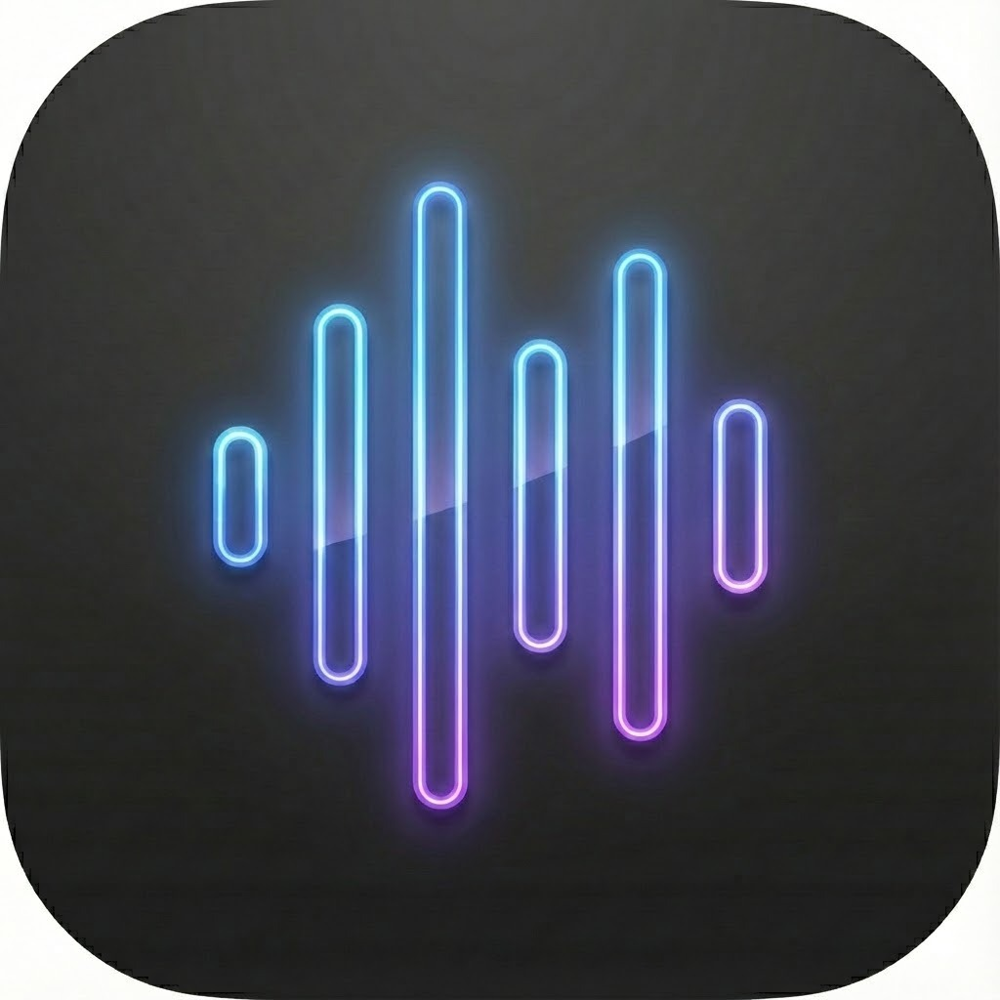

# Klip

<p align="center">
  
</p>

<p align="center">
  <strong>AI-powered voice transcription for macOS</strong><br>
  Speak naturally, get polished text instantly.
</p>

---

## Overview

Klip is a powerful macOS menu bar app that transforms your speech into perfectly formatted, context-aware text. Whether you're drafting emails, writing code commits, composing tweets, or just need quick transcriptions, Klip handles it all with a single keyboard shortcut.

**Key Features:**
- 🎙️ Real-time voice transcription using ElevenLabs Scribe
- 🤖 AI-powered text processing with Google Gemini
- 📋 Context-aware modes that understand your clipboard and screen
- 🌐 Automatic translation to any language
- ⌨️ Global hotkeys for instant access
- 🎨 Beautiful, minimal menu bar interface

---

## Installation

### Download
Download the latest `Klip.dmg` from [Releases](https://github.com/yourusername/Klip/releases).

### Manual Build
```bash
# Clone the repository
git clone https://github.com/yourusername/Klip.git
cd Klip

# Build the app
./build-app.sh

# Install
cp -r Klip.app /Applications/
```

### First Launch
Since Klip is not notarized, you'll need to bypass Gatekeeper:
1. Right-click on `Klip.app`
2. Select "Open"
3. Click "Open" in the dialog

---

## Setup

### API Keys Required
Klip requires two API keys:

1. **ElevenLabs API Key** (for transcription)
   - Sign up at [elevenlabs.io](https://elevenlabs.io)
   - Go to Profile Settings → API Keys
   - Copy your API key

2. **Google Gemini API Key** (for AI processing)
   - Visit [Google AI Studio](https://aistudio.google.com)
   - Create an API key
   - Copy your API key

### Adding API Keys
1. Click the Klip icon in your menu bar
2. Click "Settings"
3. Paste your API keys in the respective fields
4. Click "Save Keys"

> 💡 **Tip:** Toggle off "Store in Keychain" during development to avoid password prompts.

---

## Usage

### Basic Recording

| Action | Shortcut |
|--------|----------|
| Start/Stop Recording | `⌥K` (Option+K) |
| Record with Inverted Silence Mode | `⇧⌥K` (Shift+Option+K) |
| Switch Mode | `⌘1` through `⌘9` |

### Recording Modes

**Auto-stop (VAD):** Recording automatically stops when you pause speaking. Great for quick dictation.

**Manual mode:** Recording continues until you press the hotkey again. Use `⇧⌥K` to invert your default setting.

### Workflow
1. Press `⌥K` to start recording
2. Speak naturally
3. Recording stops automatically (or press `⌥K` again)
4. Processed text is copied to your clipboard
5. Paste anywhere!

---

## Modes

Klip includes 8 built-in modes, each optimized for different use cases:

### Raw
Pass-through mode. Returns your speech exactly as transcribed with no AI processing.

### Polish
Cleans up your speech into well-written prose. Removes filler words, fixes grammar, and improves clarity while preserving your voice.

### Fix
Corrects grammar, spelling, and punctuation without changing your meaning or style.

### Summary
Condenses your speech into key bullet points or a brief summary.

### Email 📋📷
Drafts professional emails based on your speech. Uses clipboard and screenshot context to understand what you're replying to.

### Message 📋📷
Writes casual messages matching the tone of the conversation. Perfect for Slack, Discord, or text messages.

### Tweet
Converts your thoughts into engaging tweets (under 280 characters).

### Commit
Generates git commit messages following conventional commit format.

### Custom Modes
Create your own modes with custom prompts in Settings → Custom Modes.

---

## Context-Aware Features

Modes marked with 📋 (clipboard) or 📷 (screenshot) can understand what you're looking at:

### Clipboard Context
When enabled, Klip reads your clipboard content and uses it to understand context. Perfect for:
- Replying to emails (copy the email first)
- Responding to messages
- Working with code snippets

### Screenshot Context
Automatically captures your active window to provide visual context. Great for:
- Describing what's on screen
- Referencing UI elements
- Working with visual content

### User Identity
Klip can include your name, email, and company in context-aware modes for more personalized responses. Configure in Settings → Your Identity.

---

## Tones

Each mode (except Raw) supports multiple tones:

| Tone | Description |
|------|-------------|
| Normal | Balanced, everyday language |
| Professional | Formal business communication |
| Casual | Friendly and relaxed |
| Concise | Short and to the point |
| Detailed | Thorough explanations |
| Friendly | Warm and approachable |
| Informal | Very casual, like texting a friend |

### Custom Tones
Create custom tones with your own prompt modifiers in Settings → Custom Tones.

---

## Translation

Enable "Translate to English" (or any target language) to automatically translate your processed output. Works with all modes.

### Supported Languages
- Auto-detect (recommended)
- English, German, Spanish, French, Italian
- Portuguese, Dutch, Polish, Russian
- Japanese, Chinese, Korean
- Croatian (and many more)

---

## Settings

### Voice Activity Detection (VAD)
- **Wait for silence:** Automatically stops recording after a pause
- **Silence duration:** How long to wait before stopping (1-5 seconds)
- **VAD sensitivity:** Adjust for noisy environments

### Input Language
Set your primary speaking language for better transcription accuracy, or use "Auto-detect" for multilingual support.

### Storage Options
- **Keychain storage:** Secure but may require password during development
- **UserDefaults:** Less secure but no password prompts

---

## Architecture

```
Klip/
├── Sources/
│   ├── main.swift              # App entry point
│   ├── AppDelegate.swift       # Menu bar and window management
│   ├── StatusBarView.swift     # Main popover UI
│   ├── SettingsView.swift      # Settings window
│   ├── Modes/
│   │   ├── ModeManager.swift   # Mode orchestration
│   │   ├── TranscriptionMode.swift  # Mode protocol
│   │   └── [Mode files]        # Individual mode implementations
│   ├── Services/
│   │   ├── ScribeService.swift # ElevenLabs WebSocket client
│   │   └── GeminiService.swift # Google Gemini API client
│   ├── Transcription/
│   │   ├── TranscriptionCoordinator.swift
│   │   └── AudioRecorder.swift
│   └── Utils/
│       ├── ClipboardManager.swift
│       ├── ScreenshotService.swift
│       ├── HotkeyManager.swift
│       ├── KeychainManager.swift
│       └── UserProfile.swift
├── Resources/
│   ├── AppIcon.icns            # App icon
│   ├── StatusBarIcon-*.png     # Menu bar icons
│   └── Info.plist              # App metadata
└── build-app.sh                # Build script
```

---

## Development

### Requirements
- macOS 13.0 or later
- Xcode Command Line Tools
- Swift 5.9+

### Building
```bash
# Development (hot reload)
swift run

# Production build
./build-app.sh
```

### Running
```bash
# Run from source
swift run

# Run built app
open Klip.app
```

---

## Permissions

Klip requires the following permissions:

| Permission | Reason |
|------------|--------|
| Microphone | Voice recording for transcription |
| Accessibility | Global hotkey support |
| Screen Recording | Screenshot context feature (optional) |

---

## Troubleshooting

### "API key not set"
Add your ElevenLabs and Gemini API keys in Settings.

### Recording doesn't stop
Try increasing the silence duration in Settings, or use manual mode (`⇧⌥K`).

### Keychain password prompts
During development, toggle off "Store in Keychain" in Settings to avoid repeated password prompts.

### App not appearing in menu bar
Check System Settings → Control Center → Menu Bar Only to ensure space is available.

### Hotkeys not working
Grant Accessibility permission in System Settings → Privacy & Security → Accessibility.

---

## Keyboard Shortcuts Reference

| Shortcut | Action |
|----------|--------|
| `⌥K` | Start/Stop recording |
| `⇧⌥K` | Recording with inverted silence mode |
| `⌘1` - `⌘9` | Switch to mode 1-9 |

---

## Credits

Built with:
- [ElevenLabs Scribe](https://elevenlabs.io) - Voice transcription
- [Google Gemini](https://ai.google.dev) - AI text processing
- SwiftUI - Native macOS interface

---

## License

MIT License - see [LICENSE](LICENSE) for details.

---

## Contributing

Contributions are welcome! Please open an issue or submit a pull request.

1. Fork the repository
2. Create a feature branch
3. Make your changes
4. Submit a pull request

---

<p align="center">
  Made with ❤️ for the Mac
</p>
